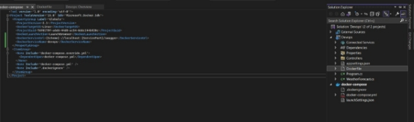
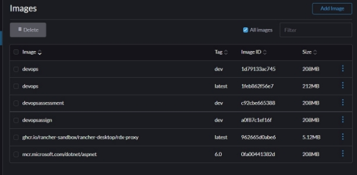
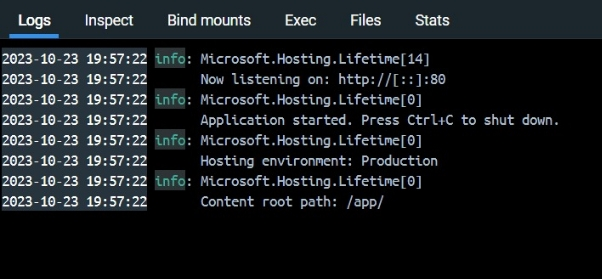
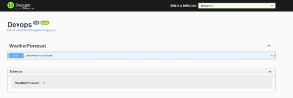



`                                                                                                                                                             `Ajay Gokul P M

`                                                    `**DevOps Assessment**                                                                                                  

1\. What does WSL stand for in the context of Windows?

`   `Answer: c. Windows Subsystem for Linux

2\. What is the primary goal of continuous integration (CI) in DevOps?

`   `Answer: b. Frequent integration of code changes

3\. In the Linux command line, what does the cd command do?

`   `Answer: b. Change the working directory

4\. Which of the following is not a Linux distribution?

`   `Answer: c. Docker

5\. What is Docker primarily used for in DevOps and containerization?

`   `Answer: c. Packaging and deploying applications in containers

6\. What is the primary purpose of Azure DevOps?

`   `Answer: b. Software development and delivery

7\. Which components are part of Azure DevOps?

`   `Answer: c. Azure Boards and Azure Pipelines

8\. How does Azure DevOps support version control in software development?

`   `Answer: b. It tracks changes in source code and manages versions.

9\. In Linux, what is the primary role of the root user?

`   `Answer: c. Administrative tasks with superuser privileges

10\. In Azure DevOps, which component is used to define, build, test, and deploy applications?

`    `Answer: c. Azure Pipelines

**Lab 1: File and Directory Management

**

**Lab 2: Permissions and Ownership**

**Lab 3: Text processing with CLI**

**Lab 4: Creating a simple yaml file**

**Lab 5: Working with lists in yaml**

**Lab 6: Nested Structures in yaml**

**Lab 7: Create classic Azure CI pipeline for Angular application**

****

` `****

**Lab 8: Create YAML Azure CI Pipeline for React Application**

**Lab 9: Create CI Pipeline for .NET Core Application with MS Unit Test**

# ASP.NET Core (.NET Framework)

# Build and test ASP.NET Core projects targeting the full .NET Framework.

# Add steps that publish symbols, save build artifacts, and more:

# https://docs.microsoft.com/azure/devops/pipelines/languages/dotnet-core

trigger:

\- master

pool: myAgent

variables:

`  `solution: '\*\*/\*.sln'

`  `buildPlatform: 'Any CPU'

`  `buildConfiguration: 'Release'

steps:

\- task: NuGetToolInstaller@1

\- task: NuGetCommand@2

`  `inputs:

`    `restoreSolution: '$(solution)'

\- task: VSBuild@1

`  `inputs:

`    `solution: '$(solution)'

`    `msbuildArgs: '/p:DeployOnBuild=true /p:WebPublishMethod=Package /p:PackageAsSingleFile=true /p:SkipInvalidConfigurations=true /p:DesktopBuildPackageLocation="$(build.artifactStagingDirectory)\WebApp.zip" /p:DeployIisAppPath="Default Web Site"'

`    `platform: '$(buildPlatform)'

`    `configuration: '$(buildConfiguration)'

\- task: VSTest@2

`  `inputs:

`    `platform: '$(buildPlatform)'

`    `configuration: '$(buildConfiguration)'

\- task: DotNetCoreCLI@2

`  `inputs:

`    `command: 'build'

\- task: DotNetCoreCLI@2

`  `inputs:

`    `command: 'test'

\- task: PublishPipelineArtifact@1

`  `inputs:

`    `targetPath: '$(Pipeline.Workspace)'

`    `publishLocation: 'pipeline'

**Lab 10: Creating a Docker Image for a .NET Core Web API and Running it in Rancher Desktop**

